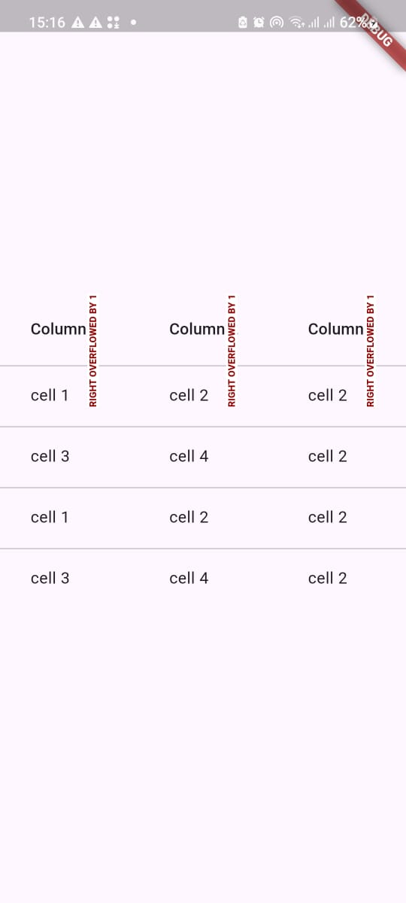
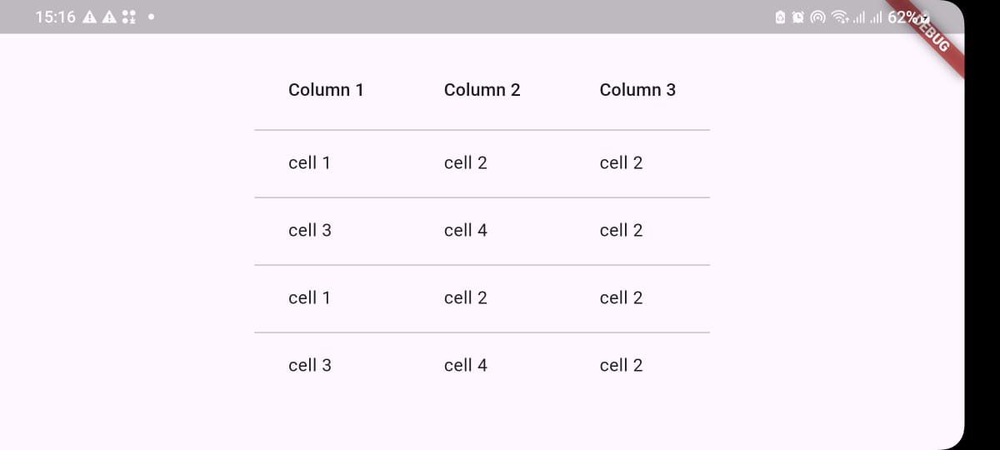

# Updated README content with run steps, attribute notes, and screenshot references
updated_readme_content = """
# 📊 Flutter Data Table Demo

This Flutter application demonstrates how to implement a simple data table using the built-in [`DataTable`](https://api.flutter.dev/flutter/material/DataTable-class.html) widget, as well as the enhanced [`DataTable2`](https://pub.dev/packages/data_table_2) widget from the `data_table_2` package for more advanced styling and flexibility.

## Features

- Display a clean, styled table with multiple rows and columns
- Option to switch between `DataTable` and `DataTable2`
- Easily customizable table layout
- Centered layout within the app's UI
- Prepared for additional decoration, such as borders and background colors

## How to Run

1. Make sure you have Flutter installed. If not, follow the [Flutter installation guide](https://docs.flutter.dev/get-started/install).
2. Clone or download this project to your local machine.
3. Navigate to the project directory:
   ```bash
   cd datatable```
4. Then install dependencies
   ```bash
   flutter pub get
5. Run the app
   ```bash
   flutter run

## How to Run
Attributes Used

### Datatable
- columns: Defines the column headers.
- rows: Defines the data cells.
- checkboxHorizontalMargin: Sets margin for checkbox column.
- clipBehavior: Controls clipping of child widgets inside the table.

### Datatable(optional)
- Offers additional spacing and decoration options.
- Use the decoration, border, minWidth, columnSpacing for advanced customization.

| Portrait Mode | Landscape Mode |
|---------------|----------------|
|  |  |


